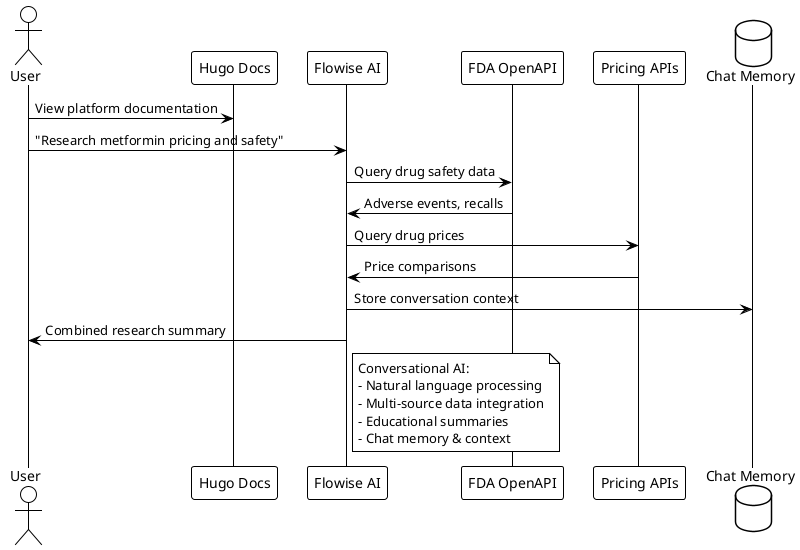

## Overview

HealthScope AI is a drug price and FDA data research platform that helps users access medication pricing information alongside FDA safety data for educational purposes.

<!-- **Target Users**: Patients, caregivers, researchers seeking to compare drug prices and access FDA safety information -->
## Core Research Areas

### 1. Drug Price Research
**Purpose**: Compare medication pricing across different sources
**Features**: 
- Pharmacy price comparisons
- Generic alternative identification
- Cost difference analysis
**Data Sources**: GoodRx API, pharmacy websites, public pricing databases

### 2. FDA Safety Data Access
**Purpose**: Access official FDA safety information
**Features**:
- Adverse event reports (FAERS database)
- Drug recall notifications
- FDA safety communications
**Data Sources**: FDA OpenAPI, official FDA databases

### 3. Combined Research
**Purpose**: Search both pricing and safety data together
**Features**:
- Natural language queries across both data types
- Comprehensive medication information compilation
- Educational research summaries

## Architecture

### System Overview



## Components

### 1. Hugo Documentation Hub
- **Purpose**: Platform information and research guides
- **Features**:
  - Research methodology documentation
  - Data source explanations
  - Usage statistics
  - Educational resources

### 2. Flowise AI Engine
- **Purpose**: Conversational interface for drug research queries
- **Technology Stack**:
  - **Platform**: Flowise AI (no-code LLM workflows)
  - **LLM Integration**: OpenAI GPT or other models
  - **Workflow Builder**: Visual drag-and-drop interface
- **Core Functions**:
  - Natural language query processing
  - Multi-source API orchestration
  - Conversational memory and context
  - Educational response formatting

### 3. Data Sources

#### FDA OpenAPI (Primary Safety Data)
- **FAERS Database**: Adverse event reports
- **Drug Recalls**: Safety alerts and recalls
- **Safety Communications**: FDA announcements
- **Drug Labels**: Official prescribing information

#### Pricing Data Sources
- **GoodRx API**: Pharmacy price comparisons
- **Public Databases**: Medicare pricing data
- **Pharmacy Websites**: Direct price information

## Research Examples

### Drug Price Research
```
Query: "Compare metformin prices in New York"

Process:
1. Search pricing databases for metformin
2. Compare prices across different pharmacies
3. Identify generic vs brand pricing
4. Format results for research purposes
```

### FDA Safety Data Research
```
Query: "FDA safety information for Lipitor"

Process:
1. Search FAERS database for adverse events
2. Check for recent recalls or safety alerts
3. Retrieve FDA safety communications
4. Compile educational summary
```

### Combined Research
```
User: "Research insulin options - pricing and safety"

Flowise Workflow:
1. Parse natural language query for drug type (insulin)
2. Trigger FDA API workflow for safety data
3. Trigger pricing API workflow for cost comparison
4. Combine results using LLM reasoning
5. Format educational summary for user
6. Store conversation context for follow-up questions
```

<!-- ## Current Development Status

- **Phase**: 1 - Data Foundation Setup
- **Focus**: FDA OpenAPI integration and pricing data access
- **Goal**: Educational research platform for medication information -->

## Data Handling

### Privacy & Compliance
- **No Personal Health Information**: Platform does not collect or store personal medical data
- **Public Data Only**: All information from publicly available sources
- **Educational Purpose**: All data provided for research and educational use only
- **Disclaimers**: Clear statements that information is not medical advice

### Data Sources Documentation
- **FDA OpenAPI**: Free access, no authentication required
- **Pricing APIs**: Rate-limited access to public pricing information
- **Data Freshness**: Regular updates from source APIs
- **Data Accuracy**: Information accuracy dependent on source databases

## Getting Started

1. **Understand the Platform**: Review this documentation
2. **Learn About Data Sources**: Understand FDA and pricing data limitations
3. **Try Research Queries**: Start with simple drug name searches
4. **Review Results**: Always verify information with healthcare providers
5. **Educational Use**: Use information for research and learning only

## Technical Implementation

### Flowise AI Architecture
- **Workflow Builder**: Visual interface for creating LLM chains
- **API Integrations**: Custom nodes for FDA and pricing APIs
- **LLM Integration**: OpenAI GPT-4 or alternative models
- **Memory Management**: Conversation context and user sessions
- **Response Formatting**: Educational summaries with proper disclaimers

### Deployment
- **Documentation**: Static Hugo site (GitHub Pages)
- **Flowise Platform**: Self-hosted or Flowise Cloud
- **API Connections**: Direct integration with FDA OpenAPI and pricing sources
- **Chat Interface**: Embedded Flowise chat widget in Hugo site

<!-- ## Contributing

This learning project welcomes contributions from:
- Healthcare data researchers
- API integration developers
- Documentation writers
- Healthcare professionals (for guidance on appropriate use) -->

## Important Disclaimers

- **Not Medical Advice**: All information for educational research only
- **Consult Healthcare Providers**: Always discuss findings with qualified medical professionals
- **Data Limitations**: Information accuracy depends on source databases
- **Educational Purpose**: Platform designed for learning and research, not clinical use

---

<!-- **Ready to research medication pricing and FDA safety data?** -->
<!-- [**🔍 Start Research →**](https://api.healthscope-ai.com) -->
